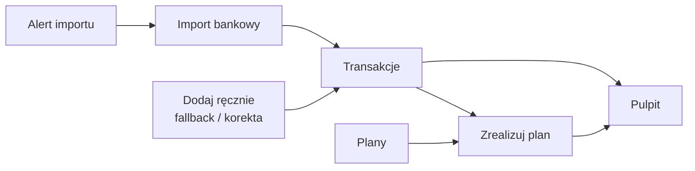

# Portfelik

Import-first personal finance PWA for understanding everyday money: import bank
history, organize transactions, plan future spending, and reconcile plans with
real transactions.

Production: [portfelik.adrianzinko.com](https://portfelik.adrianzinko.com)

## Product Loop



Portfelik is not a manual bookkeeping app with optional imports. Bank import is
the structured intake path; reminders help keep that ledger fresh; transactions
are the confirmed ledger; plans express future intent; settlement connects plans
with what actually happened.

## Features

- **Pulpit** - month view for income, expenses, balance, categories, and financial condition.
- **Transakcje** - confirmed ledger with categories, recurring entries, status tracking, CSV export, and manual fallback/corrections.
- **Import** - bank CSV intake with parser/adapters, preview, deterministic categorization rules, duplicate handling, `Inne` fallback, and commit provenance.
- **Plany** - future spending and goals with a date period, optional budget, and settlement by linking real expense/income transactions from history.
- **Reguly i kategorie** - deterministic import categorization and user-owned category management.
- **Grupy** - shared transactions/plans for couples, friends, and trusted groups, with role-based co-owner direction for managing group finance.
- **Powiadomienia i alerty** - VAPID web-push for invitations, operational summaries, and user-controlled reminders to refresh bank imports.

## Product Docs

- [Product direction](docs/product/product-direction.md) - import-first product thesis, module roles, plan settlement direction, roadmap.
- [Intent-oriented UI](docs/product/intent-oriented-ui.md) - deterministic engines, compact decision surfaces, explainable exceptions, AI guardrails.
- [Architecture](docs/architecture/README.md) - current technical system, database, flows, ADRs, and environment workflow.
- [Runbooks](docs/runbooks/) - operational procedures.

## Tech Stack

| Layer         | Choice                                       |
| ------------- | -------------------------------------------- |
| Frontend      | SvelteKit + Svelte 5 runes, `adapter-static` |
| Styling       | Tailwind v4                                  |
| Server cache  | TanStack Query v6                            |
| i18n          | Paraglide v2 (Polish)                        |
| Auth          | Supabase Auth - Google OAuth                 |
| Database      | Supabase Postgres + RLS + pg_cron            |
| Backend logic | Supabase Edge Functions (Deno)               |
| Push          | VAPID web-push                               |
| Hosting       | Cloudflare Pages                             |

## Development

```bash
cd apps/web-svelte
pnpm install
pnpm dev
```

Local development expects the local Supabase stack from the repository root:

```bash
supabase start
supabase db reset
cd apps/web-svelte
pnpm seed:local
```

## Structure

```text
apps/web-svelte/      SvelteKit app
supabase/             Migrations, config, Edge Functions
docs/product/         Product direction and interaction doctrine
docs/architecture/    Current architecture, database, flows, ADRs
docs/runbooks/        Operational procedures
.github/workflows/    CI/CD and deploy workflows
```

## Deploy

Pushes to `dev` deploy staging. Production deploys from `main`.
Use the repository PR/deploy workflows rather than hand-running production
commands unless the runbook explicitly calls for it.
