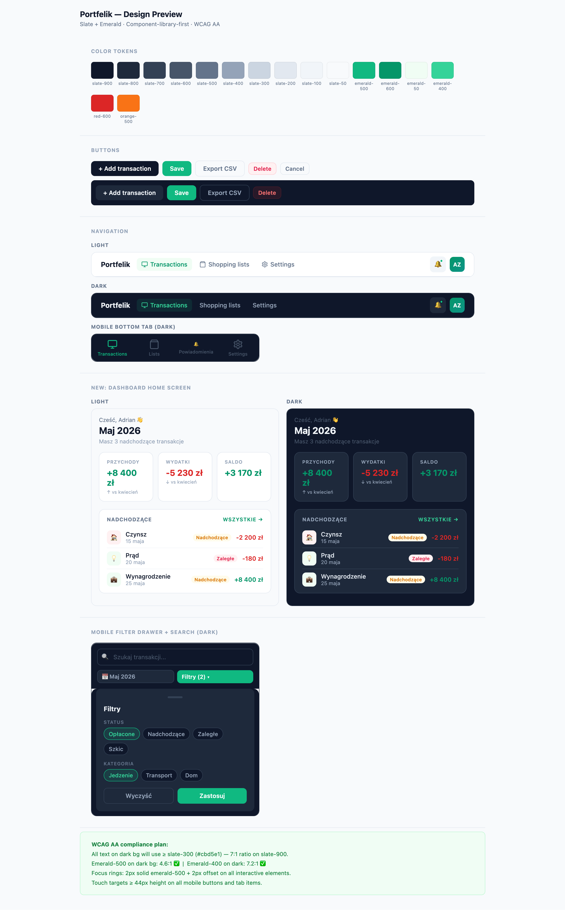

<p align="center">
  
</p>

<p align="center">
  Personal finance PWA — track income, expenses, and shopping lists with group sharing and push notifications.
</p>

<p align="center">
  <a href="https://portfelik.adrianzinko.com">portfelik.adrianzinko.com</a>
</p>

---

<p align="center">
  
</p>

<p align="center">
  
</p>

---

## Features

- **Transactions** — income/expense ledger with recurring entries, status tracking (upcoming / overdue / paid), category breakdown, and CSV import/export
- **Shopping lists** — shared lists with item suggestions, completion-to-transaction flow, and group editing
- **Group sharing** — invite members, share transactions and lists across users
- **Push notifications** — VAPID web-push for group invitations and weekly admin summaries
- **Offline-first** — cached reads via TanStack Query; works on slow/intermittent connections
- **Dark mode** — full `dark:` variant support

## Tech stack

| Layer | Choice |
|---|---|
| Frontend | SvelteKit + Svelte 5 runes, `adapter-static` |
| Styling | Tailwind v4, shadcn-svelte, bits-ui |
| Server cache | TanStack Query v6 |
| i18n | Paraglide v2 (Polish) |
| Auth | Supabase Auth — Google OAuth |
| Database | Supabase (Postgres + RLS + pg_cron) |
| Backend logic | Supabase Edge Functions (Deno) |
| Push | VAPID web-push |
| Hosting | Cloudflare Pages |

## Development

```bash
cd apps/web-svelte
pnpm install
pnpm dev
```

## Structure

```
apps/web-svelte/   ← SvelteKit app
supabase/          ← Migrations + Edge Functions
docs/architecture/ ← Overview, DB schema, flow diagrams, ADRs
.github/workflows/ ← CI/CD (typecheck + lint + e2e + deploy)
```

## Architecture

See [`docs/architecture/`](docs/architecture/README.md) — system overview, ER diagram, flow sequence diagrams, and 10 ADRs covering the key decisions.

## Deploy

Push to `main` → GitHub Actions builds and deploys to Cloudflare Pages automatically.

---

<p align="center">
  <a href=".github/img/design-preview.png">
    
  </a>
  <br/>
  <em>Design system — color tokens, components, dark mode, WCAG AA</em>
</p>
