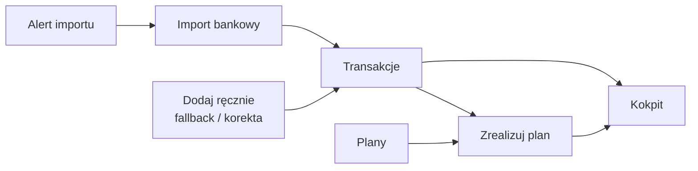

# JakStoimy

Import-first personal finance PWA for everyday money: import bank history,
organize transactions, track save/debt plans, and settle plans against real
ledger rows.

| | |
| --- | --- |
| **Product name** | JakStoimy |
| **Repo name** | `portfelik` (legacy) |
| **Production** | [app.jakstoimy.pl](https://app.jakstoimy.pl) |
| **Staging** | [dev.portfelik.pages.dev](https://dev.portfelik.pages.dev) |

Access is **invite-only** (public sign-up stays disabled). Google OAuth is the
normal path for real users; email/password personas exist only for local and
staging automation.

## Product loop


```mermaid
flowchart LR
  Import[Import bankowy] --> Transactions[Transakcje]
  Manual[Dodaj ręcznie<br/>fallback / korekta] --> Transactions
  Alerts[Alert importu] --> Import
  Plans[Plany] --> Settlement[Zrealizuj plan]
  Transactions --> Settlement
  Transactions --> Dashboard[Kokpit]
  Settlement --> Dashboard
```

Bank import is the preferred source of truth. Manual transactions are for
cash, missing rows, and corrections. Plans express future intent; settlement
links plans to existing transactions instead of inventing financial truth.

## What the app does

| Surface | Role |
| --- | --- |
| **Kokpit** | Period health: income, expenses, balance, categories, plan progress, deterministic actions |
| **Transakcje** | Confirmed ledger, upcoming/recurring rows, private cash position, export |
| **Import** | Bank CSV → parse → rules → duplicates → exception review → commit |
| **Plany** | `save` goals and `debt` loans; settle by linking; private net-worth snapshot |
| **Ustawienia** | Categories, rules, profile, groups/invites, personalization, push |

Groups support couples and trusted small groups (owner / co-owner / member).
Private and group scopes stay separate; import provenance stays owner-only.

## Tech stack

| Layer | Choice |
| --- | --- |
| App | SvelteKit + Svelte 5 runes, `adapter-static` |
| UI | Tailwind CSS v4 |
| Data client | TanStack Query v6 |
| i18n | Paraglide v2 (Polish) |
| Auth / DB | Supabase Auth + Postgres + RLS |
| Backend | Supabase Edge Functions (Deno) |
| Push | VAPID web push |
| Hosting | Cloudflare Pages (`jakstoimy`) |

## Repository layout

```text
apps/web-svelte/     SvelteKit app (run commands from here)
supabase/            Migrations, config, Edge Functions
docs/product/        Product direction + UI doctrine
docs/architecture/   System, database, flows, env workflow, ADRs
docs/runbooks/       Deploy, invite, secrets, ops
.github/workflows/   CI, staging, production
```

## Local development

Requires Docker (for local Supabase), Node, and `pnpm`.

```bash
# From repo root — start DB/Auth/API
supabase start
supabase db reset

# App
cd apps/web-svelte
pnpm install
pnpm seed:local
pnpm dev
```

`pnpm dev` reads `apps/web-svelte/.env.local` and targets local Supabase
(`127.0.0.1:54321`). Cloud credentials for optional debugging belong in
`.env.cloud.local` (gitignored).

### Useful commands (`apps/web-svelte/`)

| Command | Purpose |
| --- | --- |
| `pnpm check` | Typecheck (`svelte-check`) |
| `pnpm lint` / `pnpm format` | ESLint / Prettier |
| `pnpm test:unit` | Unit tests |
| `pnpm test:rls` | RLS + RPC integration (needs local Supabase + `.env.test`) |
| `pnpm test:e2e` | Mocked Playwright suite (mandatory for UI/copy/e2e PRs via `pr-gates.sh`) |
| `pnpm build` | Static production build → `build/` |

## Branch and deploy flow

| Branch | Environment | Supabase |
| --- | --- | --- |
| `dev` | Staging Pages | `portfelik-staging` |
| `main` | Production (`app.jakstoimy.pl`) | Production project |

- `main` is production truth. Keep `dev` synced from `main`; do not let them
  drift as independent sources of truth.
- Feature work starts from current `dev`. Promote with PR `dev` → `main`.
- Production deploy CI links the prod Supabase project, checks **migration
  parity**, deploys allowlisted Edge Functions, then deploys Pages.

Do not hand-deploy production unless a runbook says so. Prefer
`./scripts/open-pr.sh` for PR creation (runs gates and fills the template).

Full env map: [docs/architecture/env-workflow.md](docs/architecture/env-workflow.md).

## Shipping invite-only test users

Product/code is oriented for a **friends / invited test cohort**, not an open
public launch.

Before inviting people on production, confirm:

1. Local invite-day work is **committed, merged to `main`, and deployed**
2. Prod migrations include through `20260805000000` (CI parity gate must pass)
3. Edge Functions `send-group-invitation` and `sync-user-role` are deployed
4. Resend (`RESEND_API_KEY`) and invite email domain are configured
5. Auth: Google OAuth for `app.jakstoimy.pl`; **public sign-up disabled**
6. Optional but recommended: dedicated `SYNC_USER_ROLE_SECRET` (falls back to
   `INTERNAL_TRIGGER_SECRET` until set)

Operator checklist:
[docs/runbooks/first-invite-checklist.md](docs/runbooks/first-invite-checklist.md).

## Docs

| Doc | Contents |
| --- | --- |
| [Product direction](docs/product/product-direction.md) | Thesis, modules, import/settlement posture |
| [Intent-oriented UI](docs/product/intent-oriented-ui.md) | Decision-light UX contract |
| [Architecture](docs/architecture/README.md) | System, database, flows, ADRs |
| [Runbooks](docs/runbooks/) | Invite, deploy, secrets, ops lockdown |
| [CLAUDE.md](CLAUDE.md) | Agent/project status and workflow rules |
| [AGENTS.md](AGENTS.md) | Pointer to the same guidance for other agents |

## License / status

Private product. Invite-only beta. Repo name remains `portfelik` for history;
user-facing brand is **JakStoimy**.
