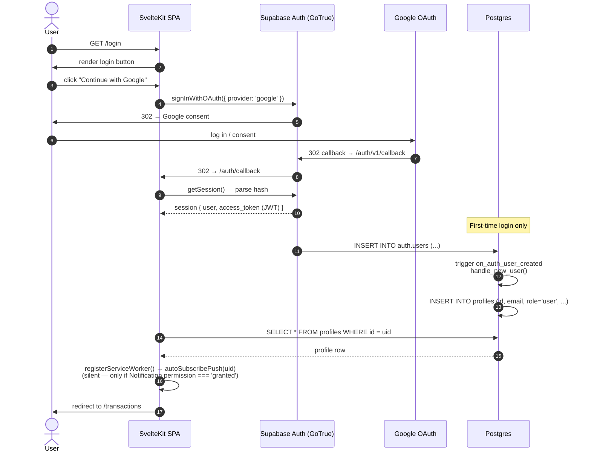
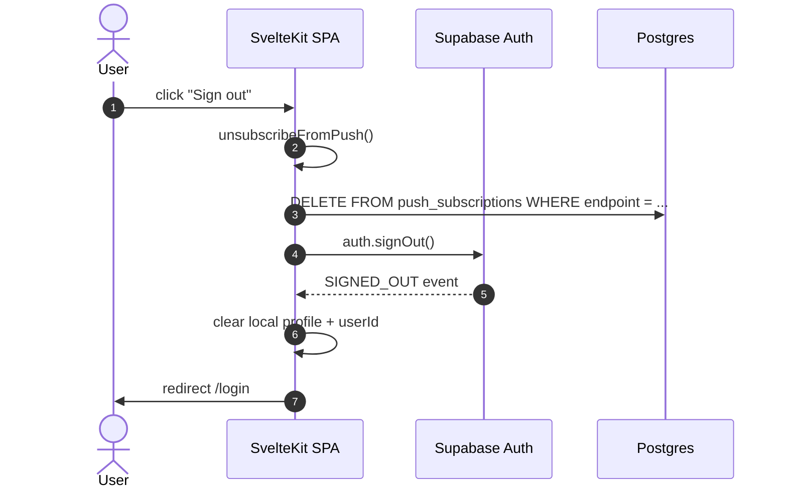
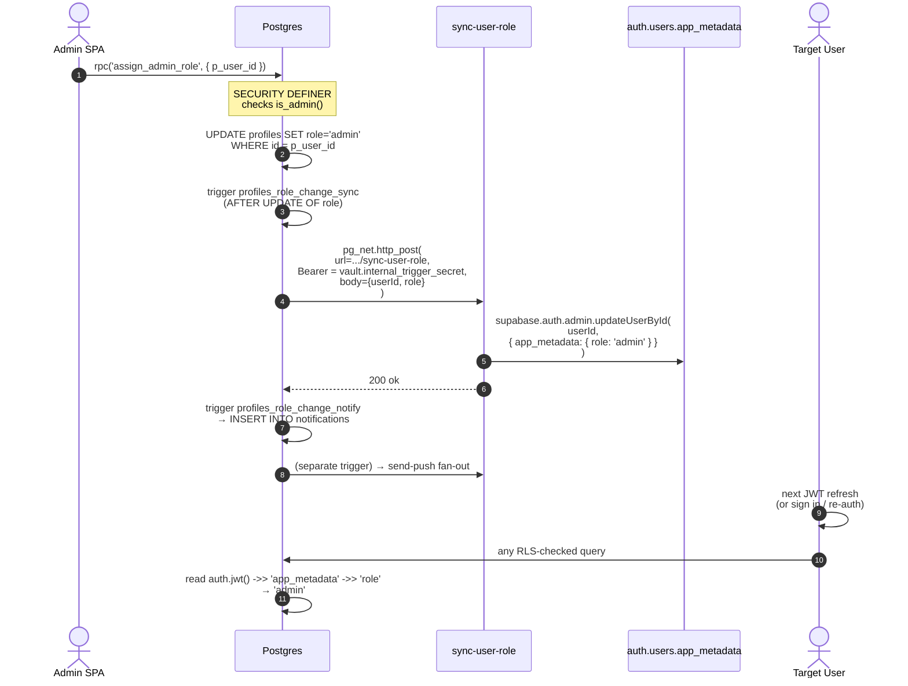

# Auth flow

Google OAuth via Supabase GoTrue. JWT carries `app_metadata.role`, mirrored from `profiles.role` by an Edge Function.

## Sign-in sequence



Source: `apps/web-svelte/src/routes/+layout.svelte` (session bootstrap), `apps/web-svelte/src/routes/login/+page.svelte` (sign-in entry), `supabase/migrations/20260423000000_initial_schema.sql` (`handle_new_user`, `on_auth_user_created`).

Notes:

- Email/password sign-up is **disabled** in `config.toml`; Google is the only enabled provider for production. The smoke-test user uses email/password explicitly enabled for the staging instance via the Supabase dashboard.
- The session lives in `localStorage` (default Supabase behaviour). `onAuthStateChange()` keeps the SPA's reactive `userId` and `profile` in sync.
- `autoSubscribePush` never prompts; the prompt only fires from the user-gesture banner button (`requestAndSubscribePush`).

## Sign-out sequence



The push-subscription cleanup happens **before** the GoTrue call so the DELETE still has a valid JWT.

## Role propagation (admin promote / demote)



Source: `supabase/functions/sync-user-role/index.ts`, `supabase/migrations/20260425000001_phase5_2_edge_function_hooks.sql` (the trigger + `pg_net` plumbing).

The role claim **takes effect at next JWT refresh**, not immediately. GoTrue refreshes on a 1-hour cadence by default; admin role changes that need to be visible immediately require the affected user to sign out and back in.

## RLS use of the JWT

Admin checks bypass `is_admin()` and read the JWT directly when feasible:

```sql
where (select auth.jwt() ->> 'app_metadata' ->> 'role') = 'admin'
```

For non-admin checks, the standard wrap is `user_id = (select auth.uid())`. Both forms ensure Postgres evaluates the auth function once per statement, not once per row.
