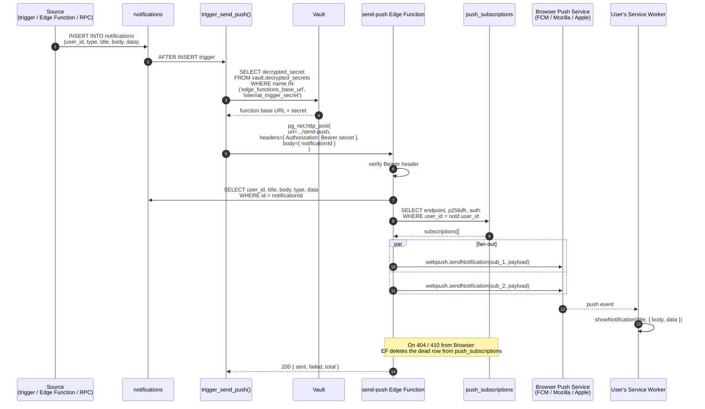
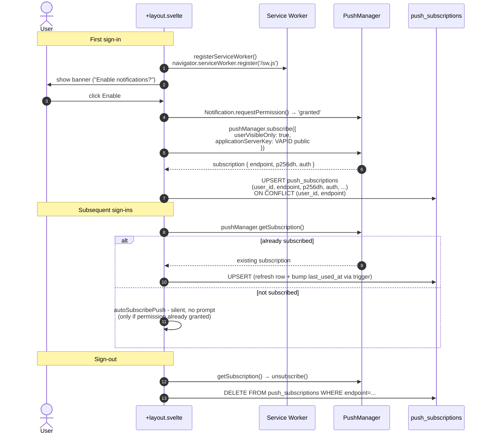

# Notifications + push

Every notification a user receives starts as a row in `public.notifications`. A trigger on that table fires `send-push`, which fans the row out as a VAPID web-push to every entry in `push_subscriptions` for the user.

## End-to-end sequence

Source:

- `supabase/migrations/20260425000001_phase5_2_edge_function_hooks.sql` - initial `trigger_send_push` trigger
- `supabase/migrations/20260524000000_environment_edge_function_urls.sql` - environment-specific Edge Function URL lookup and staging no-op behavior when hook secrets are omitted
- `supabase/functions/send-push/index.ts` - VAPID send + dead-row pruning
- `apps/web-svelte/src/lib/services/push.ts` - client subscription/unsubscription
- `apps/web-svelte/static/sw.js` - service worker push handler

## Sources of notification rows

| Source                           | Trigger                                        | Notification type                             |
| -------------------------------- | ---------------------------------------------- | --------------------------------------------- |
| `group_invitations` insert       | `notify_on_group_invitation` (after insert)    | `group_invitation`                            |
| `profiles.role` update           | `notify_on_role_change` (after update of role) | `system_notification`                         |
| `process_recurring_transactions` | daily cron                                     | `transaction_reminder`                        |
| `update_transaction_statuses`    | daily cron                                     | `transaction_upcoming`, `transaction_overdue` |
| `process_bank_import_reminders`  | daily cron                                     | `bank_import_reminder`                        |
| `send-admin-summary`             | weekly cron, fans across admins                | `transaction_summary`                         |

Every one of these ultimately just inserts a `notifications` row. The push trigger is the **single shared dispatcher** - there is no per-source HTTP indirection.

## Alerts vs. push

An alert is a product rule that decides when a notification row should exist.
Push is only one delivery channel for that row. For example, the bank-import
reminder is computed from the user's profile setting plus their latest committed
`transaction_import_sessions` row. If the browser has no push permission, the
same `bank_import_reminder` still appears in the in-app bell and links to
`/transactions/import`.

## Auth model

Edge Functions are deployed with `verify_jwt = false`. Authentication is a shared secret:

1. `INTERNAL_TRIGGER_SECRET` is set as an Edge Function secret at deploy time.
2. The same value is stored in Supabase Vault under name `internal_trigger_secret`.
3. Each cloud environment stores its own Edge Function root in Vault as
   `edge_functions_base_url` when DB hooks should dispatch. Staging omits that
   URL and the trigger secret until real staging sends are needed.
4. DB triggers read Vault values and pass `Authorization: Bearer <secret>`.
5. Edge Functions reject any request whose Bearer does not match.

This avoids needing a long-lived service-role JWT in the database, and avoids the Edge Function having to verify a user JWT it would not have access to anyway.

## Subscription lifecycle

Two important contracts:

- **`autoSubscribePush(userId)` never prompts.** It is safe to call on every page load. If permission is `default` or `denied`, it returns immediately. The prompt only fires from `requestAndSubscribePush(userId)`, which must be called from a user-gesture handler.
- **`bump_last_used_at` trigger** runs on every UPDATE to `push_subscriptions`. The auto-subscribe upsert therefore writes a fresh `last_used_at` on each session, which the admin diagnostics page surfaces.

Dead subscriptions (Browser Push Service responds 404 or 410) are pruned by `send-push` at the moment they fail.

## Why not Realtime?

Notifications could be pushed to live tabs via Supabase Realtime without web-push. The decision to use VAPID instead is recorded in `adr/0009-no-onsnapshot-realtime.md`. In short: web-push works on closed tabs and installed PWAs, Realtime does not; for a personal-finance app, the user needs to know about the weekly summary even when the tab is shut.

## In-app bell

The in-app notification list is read straight from `public.notifications` via TanStack Query (`["notifications"]`, 5-min staleTime + `refetchOnReconnect`). `mark_notification_read(id)` and `mark_all_notifications_read()` RPCs flip `read_at`. There is no Realtime subscription; the bell becomes accurate on the next refetch (most commonly when the user clicks something or comes back online).
