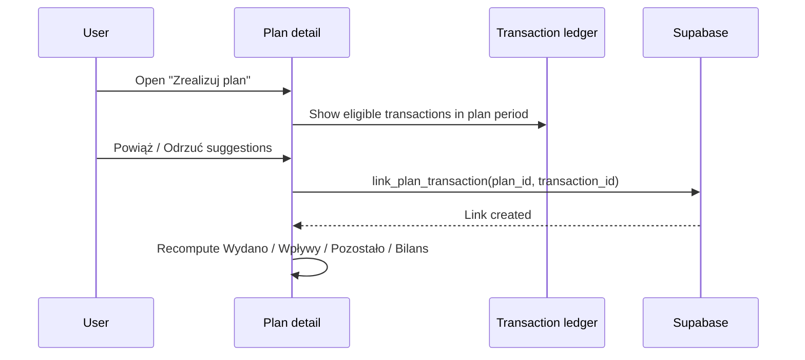

# Plan Settlement Flow

Plans use first-class `plans` storage. A plan expresses future intent over a
required date period. Current plan kinds are saving goals and loans. Financial
truth remains in `transactions`; settlement links existing expense and income
transactions via `plan_transaction_links`.

## Target Flow

## Rules

- Saving goals link income transactions; loans link expense transactions.
- A transaction can link to one plan in MVP+.
- `link_plan_transaction` enforces auth, private/group scope, supported type,
  and `transactions.date::date` inside `[plans.start_date, plans.end_date]`.
- Saving-goal `remaining` is `target_amount - savedAmount`; loan progress is
  driven by linked expense transactions and loan terms.
- A manual transaction created from a plan is fallback only; after creation it
  should be linked through the same settlement model.
- Deterministic matching produces rank percentage and reasons before the user
  accepts or rejects a suggestion.

## Retired

The first-class Plans cut removes app reliance on `shopping_lists`,
`shopping_list_items`, `transactions.shopping_list_id`, `complete_shopping_list`,
`attach_shopping_list_to_transaction`, and checklist progress.
