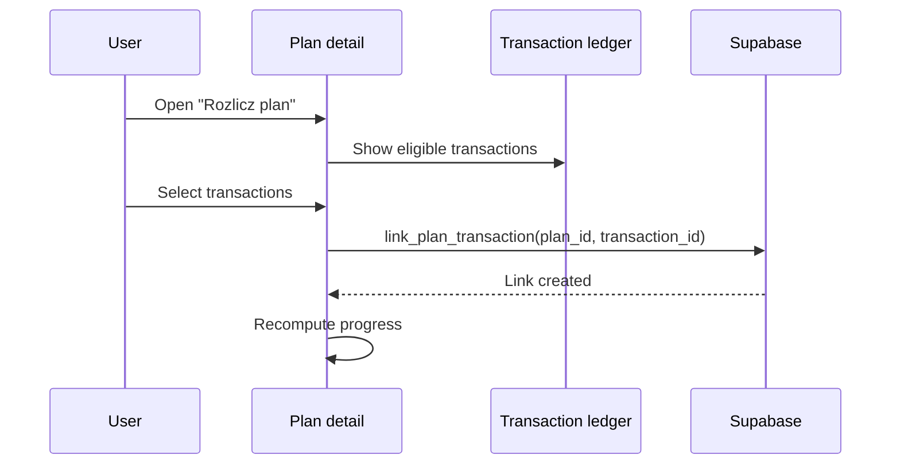

# Plan Settlement Flow

User-facing Plans are the product evolution of the current `shopping_lists`
storage. Current code still supports completing a list and optionally creating a
transaction, but the product direction is to settle plans by linking them to
existing ledger transactions.

## Target Flow

## Rules

- A plan can link to many transactions.
- A transaction can link to one plan in MVP+.
- A manual transaction created from a plan is fallback only; after creation it
  should be linked through the same settlement model.
- Future deterministic matching should produce score and reasons before the user
  accepts or rejects a suggestion.

## Current Compatibility

Today the database still contains:

- `shopping_lists`
- `shopping_list_items`
- `transactions.shopping_list_id`
- `complete_shopping_list(...)`
- `attach_shopping_list_to_transaction(...)`

These are compatibility surfaces for the current app. They should not be used as
the future design model for plan settlement. New settlement work should introduce
a dedicated link table and RPCs rather than expanding `transactions.shopping_list_id`.
