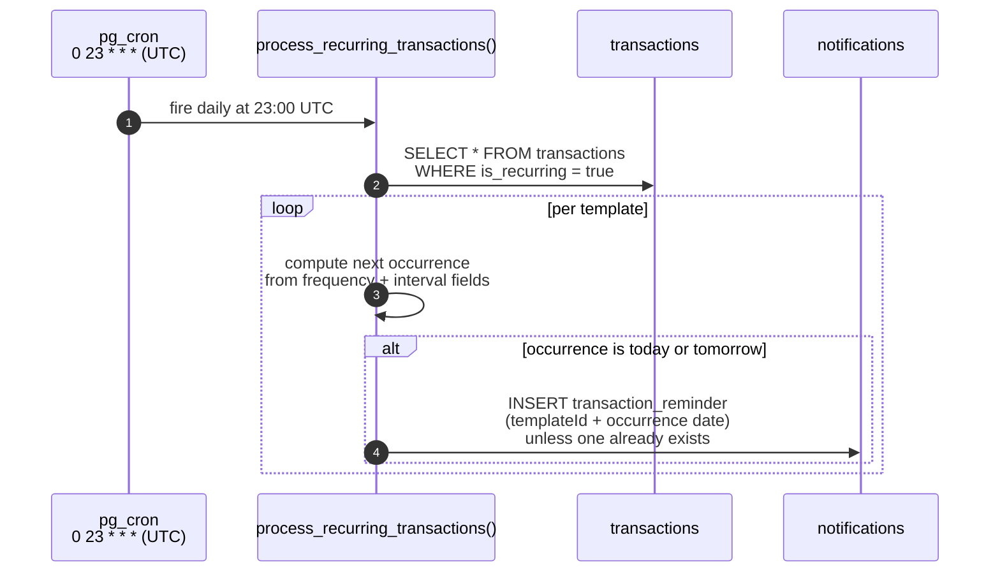
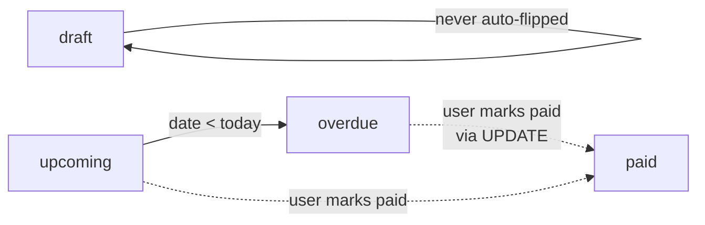
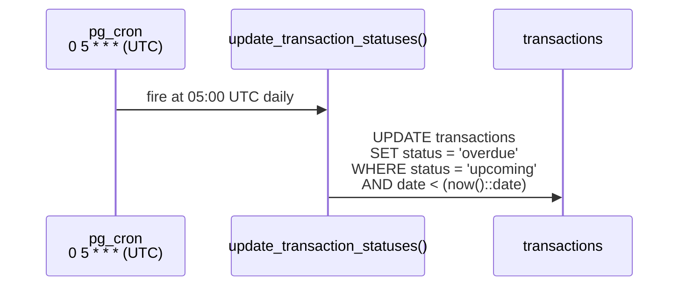

# Recurring reminders + status updates

Two daily SQL jobs keep the ledger consistent without any application code running.

## `process_recurring_transactions` - daily, reminder-only

A row with `is_recurring = true` is a **template**. Since
`20260703000000_recurring_reminders_only.sql` the job **never creates
transaction rows**. It computes each template's next occurrence
(frequency-aware: daily / weekly / monthly / yearly with interval, weekday,
month, and day-of-month clamping) and, when that occurrence is today or
tomorrow, inserts a `transaction_reminder` notification. The existing
after-insert trigger on `notifications` fans the reminder out via web push.

Rationale: financial truth comes from bank import or explicit manual entry.
The previous materializing design cloned templates into `upcoming` rows —
including a same-day duplicate of an already-recorded payment — which the
status job then flipped to `overdue` with a phantom alert. Recurrence now
expresses intent (a reminder), not truth (a ledger row).

Correctness properties:

- **Idempotent per occurrence.** Dedupe is keyed on
  (`user_id`, `data->>'templateId'`, `data->>'date'`) with a partial index, so
  re-running the job produces no duplicate reminders.
- **Frequency-aware.** Daily, weekly, monthly, and yearly templates use their
  recurrence-specific fields; monthly/yearly clamp day-of-month (a template for
  day 31 in February reminds on the 28th, 29th in a leap year).
- **No writes to `transactions`.** The job's only side effect is notification
  rows.

Source: `supabase/migrations/20260606000000_recurring_frequency.sql`
(frequency model + date math) and
`supabase/migrations/20260703000000_recurring_reminders_only.sql`
(reminder-only rewrite). The historical materializing design lived in
`20260425000000` / `20260426000000`; its `recurring_template_id` column was
dropped in `20260705000000_drop_recurring_template_id.sql`.

## `update_transaction_statuses` - daily

Flips `status` based on `date` vs `now()` for **manually created** `upcoming`
rows (the recurring job no longer produces any).

Status `paid` and `draft` are user-set and never auto-flipped. The job also
sends due-today / due-tomorrow reminder notifications for `upcoming` rows.

## DST drift

Both jobs are scheduled in UTC. The local-Warsaw fire time shifts by one hour around DST transitions:

| Period                              | Warsaw offset | Recurring fire (Warsaw) | Status fire (Warsaw) |
| ----------------------------------- | ------------- | ----------------------- | -------------------- |
| Winter (UTC+1, late Oct → late Mar) | +1            | daily 00:00             | daily 06:00          |
| Summer (UTC+2, late Mar → late Oct) | +2            | daily 01:00             | daily 07:00          |

This is acknowledged and accepted; users do not directly observe these times. See [audit](../audit-2026-05-09.md) item G6.

## Why pg_cron instead of an Edge Function?

These jobs are pure SQL - no HTTP, no I/O outside the database. Wrapping them in a Deno function would add an extra hop, an extra failure mode, an extra place to read logs, and a bearer-secret indirection. `pg_cron.schedule(...)` plus an inline function is the simplest possible thing that works.

The third scheduled job - `send-admin-summary` - _is_ an Edge Function call (because it sends pushes), and it is launched from `pg_cron` via `pg_net.http_post`. That hybrid model is the reason both kinds of scheduling coexist; see `adr/0007-pg-cron-plus-edge-functions.md`.
