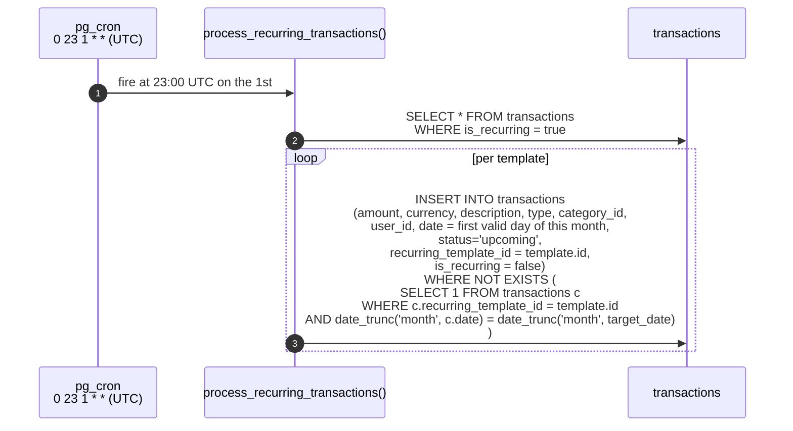
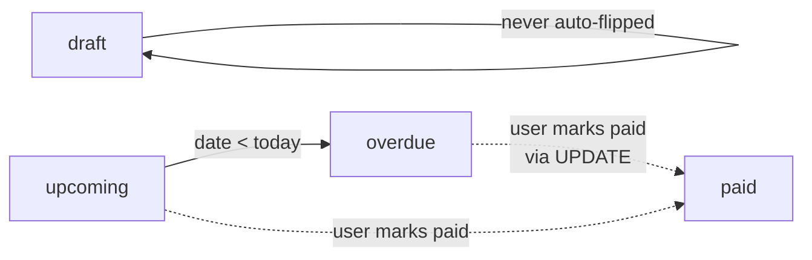
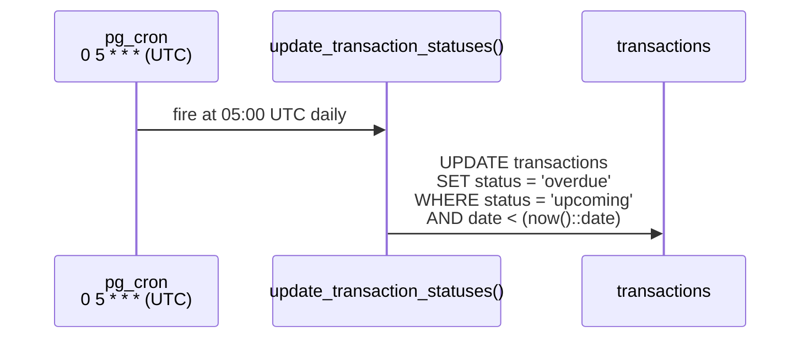

# Recurring transactions + status updates

Two daily/monthly SQL jobs keep the ledger consistent without any application code running.

## `process_recurring_transactions` — monthly

A row with `is_recurring = true` and a non-null `recurring_day` (1–31) is a **template**. Every month, this job creates one child ledger row per template, dated at the requested day of the month.

Two correctness properties:

- **Idempotent within a month.** The `NOT EXISTS` predicate keyed on `recurring_template_id` plus the truncated month means re-running the job in the same month produces no duplicates. Useful for catching up after platform downtime.
- **Day-of-month clamping.** A template with `recurring_day = 31` in February yields the 28th (or 29th in a leap year). Implementation uses `date_trunc + day` clamping inside the SQL.

Source: `supabase/migrations/20260425000000_phase5_notifications_push.sql` (function + cron schedule), `supabase/migrations/20260426000000_fix_recurring_template_id.sql` (FK + dedup hardening).

## `update_transaction_statuses` — daily

Flips `status` based on `date` vs `now()`.

Status `paid` and `draft` are user-set and never auto-flipped. The job is a single statement with no per-row work; it is fast even on large tables.

## DST drift

Both jobs are scheduled in UTC. The local-Warsaw fire time shifts by one hour around DST transitions:

| Period | Warsaw offset | Recurring fire (Warsaw) | Status fire (Warsaw) |
|---|---|---|---|
| Winter (UTC+1, late Oct → late Mar) | +1 | 1st 00:00 | daily 06:00 |
| Summer (UTC+2, late Mar → late Oct) | +2 | 1st 01:00 | daily 07:00 |

This is acknowledged and accepted; users do not directly observe these times. See [audit](../audit-2026-05-09.md) item G6.

## Why pg_cron instead of an Edge Function?

These jobs are pure SQL — no HTTP, no I/O outside the database. Wrapping them in a Deno function would add an extra hop, an extra failure mode, an extra place to read logs, and a bearer-secret indirection. `pg_cron.schedule(...)` plus an inline function is the simplest possible thing that works.

The third scheduled job — `send-admin-summary` — *is* an Edge Function call (because it sends pushes), and it is launched from `pg_cron` via `pg_net.http_post`. That hybrid model is the reason both kinds of scheduling coexist; see `adr/0007-pg-cron-plus-edge-functions.md`.
