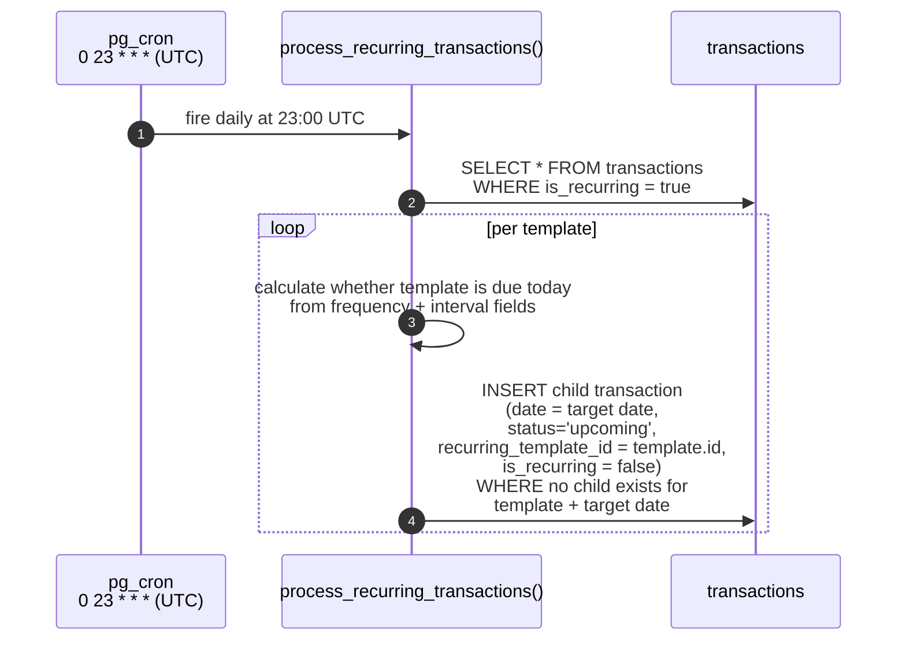
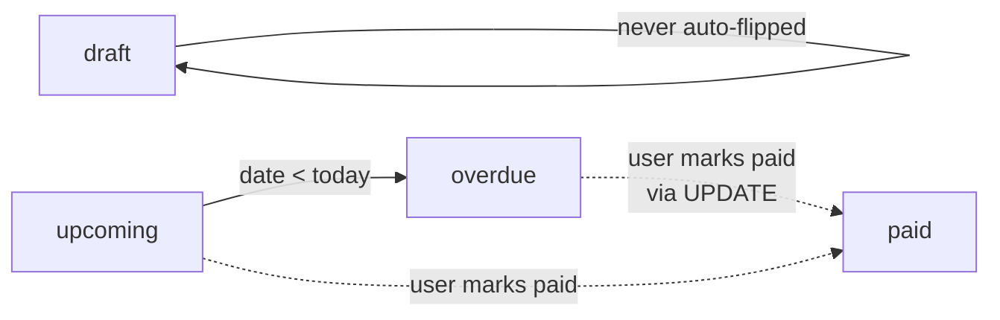
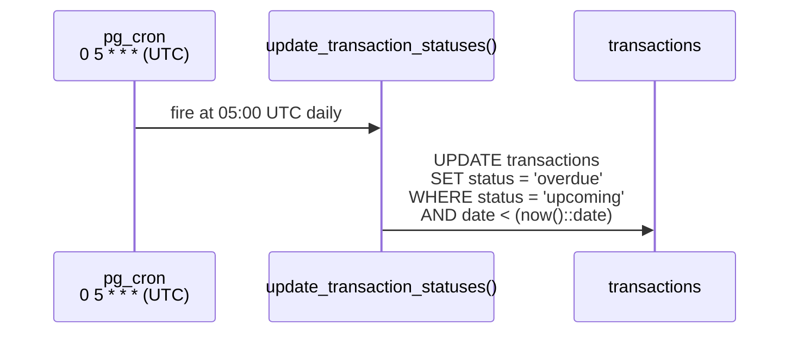

# Recurring transactions + status updates

Two daily SQL jobs keep the ledger consistent without any application code running.

## `process_recurring_transactions` - daily

A row with `is_recurring = true` is a **template**. The job runs daily so
daily, weekly, monthly, and yearly recurrences can all fire close to their due
date. Each run creates only the children due for the current date.

Two correctness properties:

- **Idempotent per target date.** The dedupe predicate is keyed on
  `recurring_template_id` plus the calculated child date, so re-running the job
  for the same due date produces no duplicates. Useful for catching up after
  platform downtime.
- **Frequency-aware.** Daily, weekly, monthly, and yearly templates use their
  recurrence-specific fields to decide whether today is due.
- **Day-of-month clamping.** A monthly template for day 31 in February yields
  the 28th (or 29th in a leap year).

Source: `supabase/migrations/20260425000000_phase5_notifications_push.sql`
(original function + cron schedule),
`supabase/migrations/20260426000000_fix_recurring_template_id.sql` (FK +
dedup hardening), and
`supabase/migrations/20260606000000_recurring_frequency.sql` (frequency-aware
daily producer).

## `update_transaction_statuses` - daily

Flips `status` based on `date` vs `now()`.

Status `paid` and `draft` are user-set and never auto-flipped. The job is a single statement with no per-row work; it is fast even on large tables.

## DST drift

Both jobs are scheduled in UTC. The local-Warsaw fire time shifts by one hour around DST transitions:

| Period                              | Warsaw offset | Recurring fire (Warsaw) | Status fire (Warsaw) |
| ----------------------------------- | ------------- | ----------------------- | -------------------- |
| Winter (UTC+1, late Oct → late Mar) | +1            | daily 00:00             | daily 06:00          |
| Summer (UTC+2, late Mar → late Oct) | +2            | daily 01:00             | daily 07:00          |

This is acknowledged and accepted; users do not directly observe these times. See [audit](../audit-2026-05-09.md) item G6.

## Why pg_cron instead of an Edge Function?

These jobs are pure SQL - no HTTP, no I/O outside the database. Wrapping them in a Deno function would add an extra hop, an extra failure mode, an extra place to read logs, and a bearer-secret indirection. `pg_cron.schedule(...)` plus an inline function is the simplest possible thing that works.

The third scheduled job - `send-admin-summary` - _is_ an Edge Function call (because it sends pushes), and it is launched from `pg_cron` via `pg_net.http_post`. That hybrid model is the reason both kinds of scheduling coexist; see `adr/0007-pg-cron-plus-edge-functions.md`.
