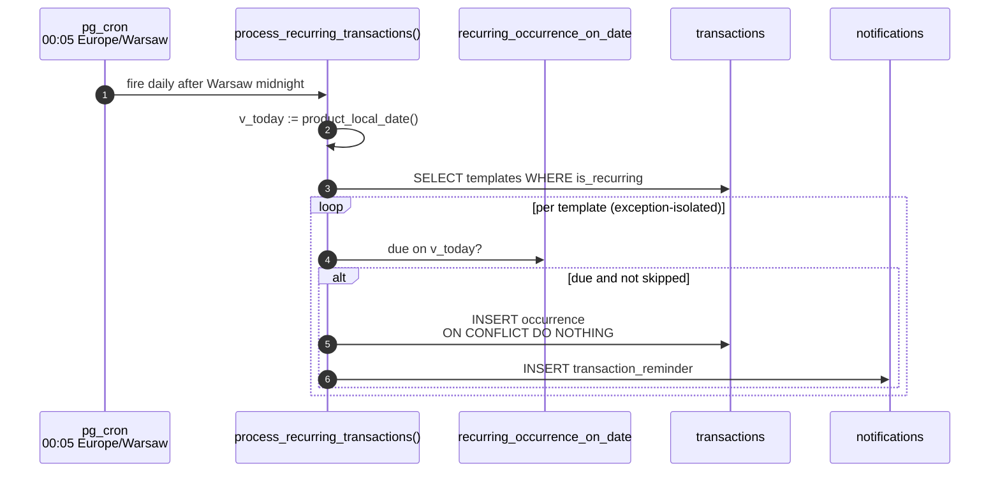
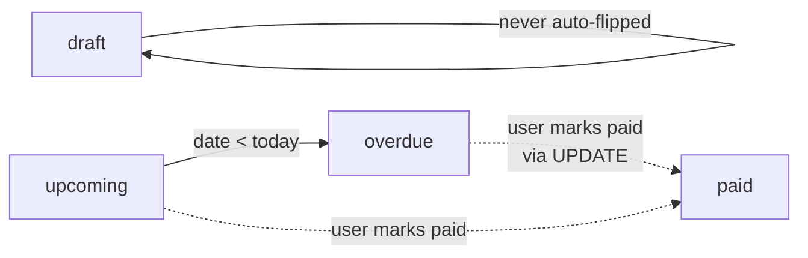

# Recurring reminders + status updates

Two daily SQL jobs keep the ledger consistent without any application code running.

## Canonical recurrence math

Shared pure primitive (PR 2A):

- SQL: `public.recurring_occurrence_dates` / `public.recurring_occurrence_on_date`
- Client: `apps/web-svelte/src/lib/services/recurrence-dates.ts` (mirrored by
  `projectRecurringOccurrences`)

Calendar math uses UTC date parts on `YYYY-MM-DD` strings; **due-day “today”**
for the cron is the product-local calendar date in **Europe/Warsaw** via
`public.product_local_date()`.

## `process_recurring_transactions` — daily, materialize + remind

A row with `is_recurring = true` is a **template**. The daily job:

1. Evaluates `v_today = product_local_date()` (Warsaw).
2. For each template, asks `recurring_occurrence_on_date(..., v_today, recurrence_end_date)`.
3. If due today (and not skipped / already reminded): materializes one
   `upcoming` occurrence keyed by
   `unique (recurring_template_id, recurring_occurrence_date)` (logical slot),
   then inserts an actionable `transaction_reminder` notification.

Client near-term materialization (`materializeRecurringOccurrencesForNearTerm`)
and series actions (`skip` / `end` / `materialize` RPCs) use the same date
primitive and uniqueness constraint.

```mermaid
sequenceDiagram
    autonumber
    participant Cron as pg_cron<br/>00:05 Europe/Warsaw
    participant Job as process_recurring_transactions()
    participant Prim as recurring_occurrence_on_date
    participant T as transactions
    participant N as notifications

    Cron->>Job: fire daily after Warsaw midnight
    Job->>Job: v_today := product_local_date()
    Job->>T: SELECT templates WHERE is_recurring
    loop per template (exception-isolated)
        Job->>Prim: due on v_today?
        alt due and not skipped
            Job->>T: INSERT occurrence<br/>ON CONFLICT DO NOTHING
            Job->>N: INSERT transaction_reminder
        end
    end
```

Correctness properties:

- **Product-local due day.** Uses Warsaw calendar date, not raw `current_date`
  (which follows the DB session timezone and was one local day late vs intent).
- **End date honored.** `recurrence_end_date` is an inclusive maximum in the
  shared primitive.
- **Never before anchor.** Occurrences before the template start date are not
  emitted.
- **Phase-aligned intervals.** Monthly/yearly steps keep the template’s
  month/day phase (and clamp day 31 / Feb 29).
- **Logical uniqueness.** One row per `(template, occurrence_date)` across
  group members.
- **Per-template isolation.** A malformed template raises a WARNING and the
  loop continues; one bad row cannot abort the cron run.
- **Idempotent per occurrence.** Dedupe for reminders is keyed on
  (`user_id`, `data->>'templateId'`, `data->>'date'`); materialization conflicts
  are no-ops.

Atomic series mutations (PR 2C): `skip_recurring_occurrence`,
`end_recurring_series_from_occurrence`, `prune_recurring_occurrences_from`,
`materialize_recurring_occurrence`, `bulk_delete_transactions`.

Source migrations: `20260803030000` (primitive), `20260803040000` (uniqueness),
`20260803050000` (series RPCs), `20260803060000` (Warsaw date + isolation +
schedule).

## `update_transaction_statuses` - daily

Flips `status` based on `date` vs `now()` for `upcoming` rows and sends
due-today / overdue reminder notifications.

```mermaid
flowchart LR
    draft[draft] -->|never auto-flipped| draft
    upcoming[upcoming] -->|date < today| overdue[overdue]
    overdue[overdue] -.->|user marks paid<br/>via UPDATE| paid[paid]
    upcoming -.->|user marks paid| paid
```

Status `paid` and `draft` are user-set and never auto-flipped.

## Schedule

| Job | Schedule | Local intent |
|---|---|---|
| `process-recurring-transactions` | `5 0 * * *` with `timezone = Europe/Warsaw` when supported; else `5 23 * * *` UTC | Shortly after Warsaw midnight; due-day math always uses `product_local_date()` |
| `update_transaction_statuses` | `0 5 * * *` UTC | Status flips / overdue reminders |

## Why pg_cron instead of an Edge Function?

These jobs are pure SQL - no HTTP, no I/O outside the database. Wrapping them in a Deno function would add an extra hop, an extra failure mode, an extra place to read logs, and a bearer-secret indirection. `pg_cron.schedule(...)` plus an inline function is the simplest possible thing that works.

The third scheduled job - `send-admin-summary` - _is_ an Edge Function call (because it sends pushes), and it is launched from `pg_cron` via `pg_net.http_post`. That hybrid model is the reason both kinds of scheduling coexist; see `adr/0007-pg-cron-plus-edge-functions.md`.
