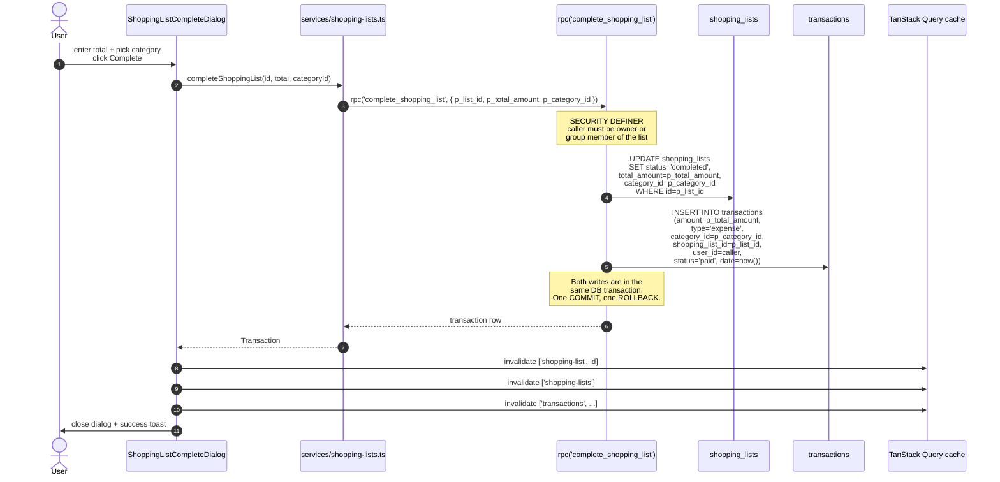

# Shopping list completion

"Complete this shopping list" is a single atomic operation that flips the list to `completed` and creates a linked expense transaction in the same DB transaction. Implemented by the `complete_shopping_list` SECURITY DEFINER RPC.

## Sequence

Source: `supabase/migrations/20260423000000_initial_schema.sql:1114-...` (`complete_shopping_list`), `apps/web-svelte/src/lib/services/shopping-lists.ts` (`completeShoppingList`).

## Authorisation

The RPC checks: caller is the owner OR a member of the list's `group_id` (if any). Direct UPDATE on `shopping_lists` is allowed by RLS to any group member, but completion *must* go through the RPC because:

- the linked `transactions` row has `user_id = caller`, not `user_id = list.owner`. A group member who completes someone else's shared list is the one who paid; the transaction is recorded against them.
- atomicity. If the transaction insert fails (e.g. category constraint), the list status flip is rolled back too.

## Why not have the client do both writes?

Two writes from the client cannot be made atomic. The client could insert the transaction, then update the list, but a network failure between the two would leave the list `active` with an orphaned transaction. The RPC keeps both inside one Postgres transaction.

## Related: attach an existing transaction (deferred for MVP)

There was a reverse path designed for already-recorded spend: from the transaction detail sheet, linking an unlinked expense to an active shopping list via `attach_shopping_list_to_transaction(p_list_id, p_tx_id)`.

**This UI is intentionally not shipped in MVP.** The primary reconciliation workflow is:

1. Complete the shopping list (optionally creating the expense transaction), **or**
2. Import bank transactions weekly and rely on duplicate detection to match imported rows against list-created expenses.

The attach RPC remains in the database for a possible future advanced flow. Do not document it as a user-facing MVP feature.

If implemented later, the RPC keeps the same domain guards: the list must contain at least one item, the transaction must be an expense without an existing `shopping_list_id`, and list/transaction sharing scopes must match.

## Caveat — isolation level

The RPC runs at the default Postgres isolation (READ COMMITTED). Two simultaneous completions of the same list would both succeed: the second one would mark a `completed` list `completed` again and create a second transaction. There is no explicit row lock or status check inside the RPC. Risk is negligible in practice (single user, slow UI), but it is a real edge case and is recorded in the audit.

See [audit](../audit-2026-05-09.md) for the open quality items.

## Related: duplicate

`duplicate_shopping_list(p_list_id)` is the sibling RPC. Unlike `complete_shopping_list` it is **SECURITY INVOKER** — it relies on the caller's RLS so a user can only duplicate lists they can already see. Adds a single row to `shopping_lists` plus copies of all `shopping_list_items`, then resets `status='active'` and clears `total_amount`.
