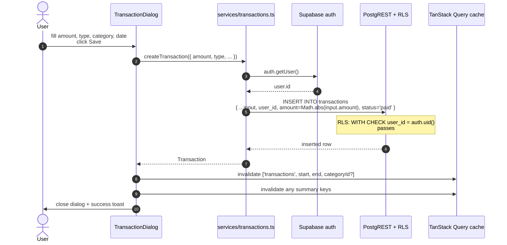
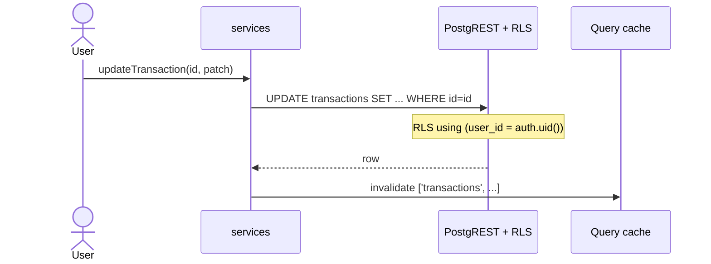
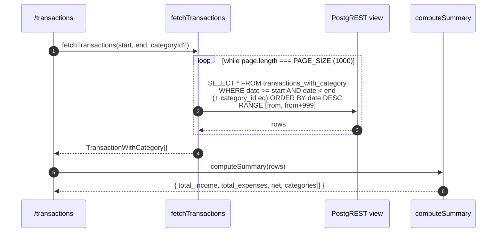
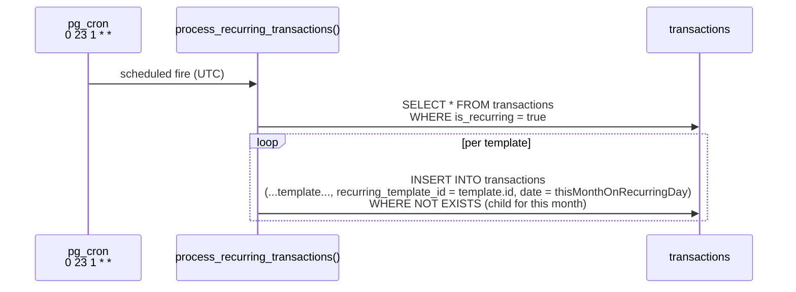

# Transaction CRUD + summary

The most-trafficked surface in the app. All four operations are direct PostgREST writes (no RPC), and the monthly summary is computed **client-side** from the result set, not via an aggregate RPC.

## Create

Two non-obvious bits:

- `user_id` is **passed explicitly** by the service. RLS does not auto-fill `NOT NULL` columns; PostgREST inserts must include them.
- `amount` is normalised to `Math.abs(...)` because the schema CHECK is `amount > 0`. Sign is carried by `type`.

Source: `apps/web-svelte/src/lib/services/transactions.ts:89-109`.

## Update / delete

Same shape, no `user_id` plumbing on update (RLS `using (user_id = auth.uid())` plus the original ownership is enough). `deleteTransactions(ids[])` exists for the bulk-delete UI.

## Read + summary

Why client-side?

- The dataset is **personal-finance-sized**: tens to low-hundreds of rows per month per user. The aggregation happens on data already in memory - the round-trip cost of `get_monthly_summary` would dominate the actual work.
- Filters change interactively (category click-through, range tweaks). Recomputing locally is instantaneous; an RPC would add a network hop per click.
- A SECURITY INVOKER `get_monthly_summary` RPC exists in the schema as an alternative. It is **currently unused** by the SPA but is preserved as a fallback (e.g. for a future server-rendered dashboard or a CSV export endpoint).

Source: `apps/web-svelte/src/lib/services/transactions.ts:11-75`, `supabase/migrations/20260423000000_initial_schema.sql:1279-...` (`get_monthly_summary`).

## Recurring templates

A row with `is_recurring = true` is a **template**, not a real ledger entry. `pg_cron` materialises children once per month:

The dedup predicate uses `recurring_template_id` so a re-run within the same month is a no-op. Status flips by the daily `update_transaction_statuses` job (separate flow).

See `flows/recurring-transactions.md` for the full sequence.

## Error surfaces

- **RLS denial** - PostgREST returns `42501` and the row count zero; surfaces as a generic error toast. (Should rarely happen - UI never shows transactions the user can't write to.)
- **CHECK constraint** - `amount > 0` violation returns a Postgres error; surfaces as a toast.
- **Network failure** - TanStack Query retries up to twice; on terminal failure, mutation `.error` triggers a toast. **No write outbox** - the change is lost. See [audit](../audit-2026-05-09.md) item G1.
