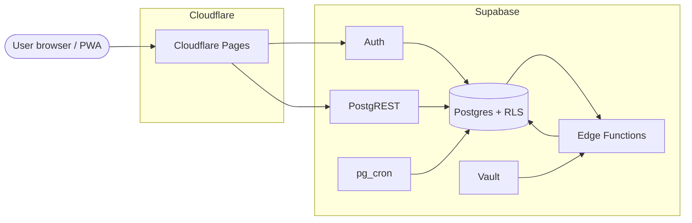
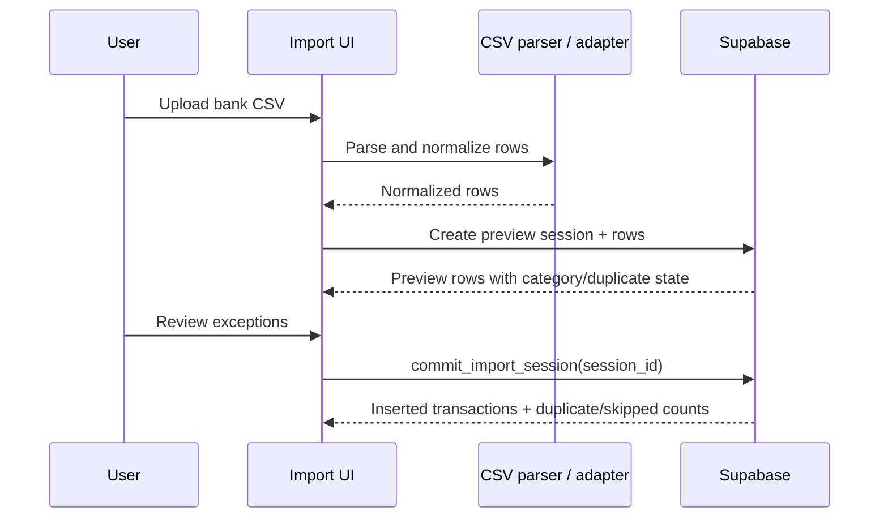
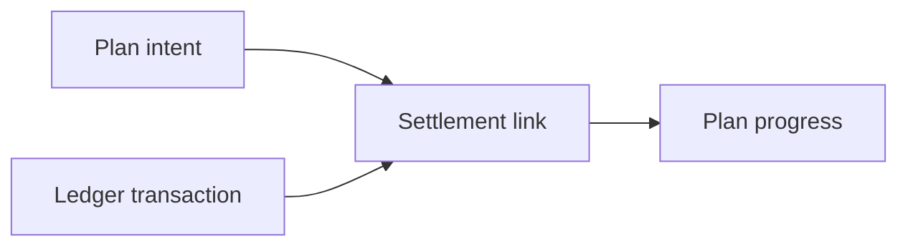

# System Overview

Portfelik is a static SvelteKit PWA backed by Supabase. The product direction is
import-first: bank files feed the transaction ledger, plans describe future
intent, and settlement connects plans with real transactions.

## System Context



There is no application server. The SvelteKit build is static; browser code
uses Supabase directly. Authorization is enforced in Postgres RLS and
SECURITY DEFINER RPCs.

## Product Modules

```mermaid
flowchart LR
  Dashboard[/dashboard<br/>Pulpit]
  Transactions[/transactions<br/>Transakcje]
  Import[/transactions/import today<br/>/import planned]
  Plans[/plans<br/>Plany]
  Settings[/settings<br/>Ustawienia]

  Import --> Transactions
  Transactions --> Dashboard
  Plans --> Dashboard
  Transactions --> Plans
```

User-facing **Plany** live at `/plans` with `save` goals and `debt` loans,
manual net-worth snapshots (`financial_snapshots`), and settlement via
`plan_transaction_links`. Bank import remains at `/transactions/import` today;
product direction treats it as **Import**.

## Frontend Structure

| Area | Current files |
| --- | --- |
| Routes | `apps/web-svelte/src/routes/` |
| Services | `apps/web-svelte/src/lib/services/` |
| Import parsing | `apps/web-svelte/src/lib/import/` |
| Import review UI | `apps/web-svelte/src/lib/components/import/` |
| Transaction UI | `apps/web-svelte/src/lib/components/transactions/` |
| Plans UI | `apps/web-svelte/src/lib/components/plans/` |
| i18n | `apps/web-svelte/messages/pl.json` |

Services wrap Supabase calls. Owner-managed tables use direct PostgREST writes
with explicit `user_id`; group-sensitive and multi-row operations use RPCs.

## Data Flow

### Import To Ledger



Import provenance is stored in `transaction_import_links`, not on shared
transaction rows. This keeps bank metadata owner-only.

### Plans To Settlement



Current implementation stores plans in `plans` and settlement links in
`plan_transaction_links`. Progress is derived from linked income/expense
transactions, not from checklist state or plan-created ledger rows.

## Runtime Patterns

- Svelte 5 runes for local reactivity.
- TanStack Query v6 for server cache and invalidation.
- Paraglide v2 for compile-time Polish i18n.
- `@supabase/supabase-js` base client only; no `@supabase/ssr`.
- `svelte-sonner` for toasts.
- Cloudflare Pages deploys static builds from `dev` and `main`.

## Offline Behavior

Reads use TanStack Query's offline-first cache. Writes do not have a durable
client-side outbox yet; failed offline writes surface as errors. A Dexie-backed
write queue remains deferred.
