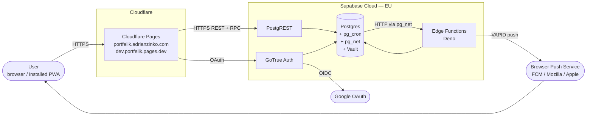
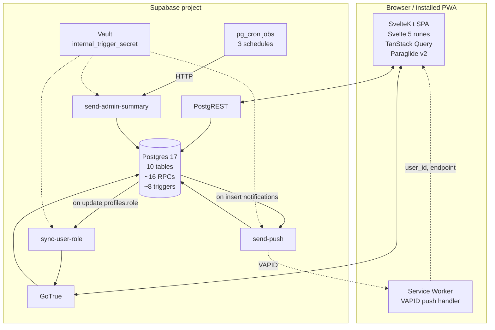
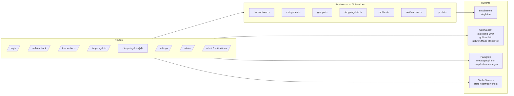

# System overview

A C4-lite view of Portfelik: context first, then containers, then components inside the SvelteKit SPA.

## 1. System context



Two browser-to-server channels:

1. **PostgREST** for table reads/writes and SECURITY DEFINER RPC calls. All authorisation is enforced by Postgres RLS using the JWT supplied by GoTrue Auth.
2. **Web-push** delivered out-of-band by the user agent's push service after a VAPID-signed envelope is sent from `send-push`.

There is **no application server**. The SvelteKit build is a static bundle (no SSR, no `+server.ts` routes); every request from the browser hits Supabase directly.

## 2. Container view



| Container | Role |
|---|---|
| **SvelteKit SPA** | Static bundle (`adapter-static`), served by Cloudflare Pages. Handles all UI, talks to Supabase via `@supabase/supabase-js`. |
| **Service worker** | Receives VAPID push payloads, displays browser notifications, no caching layer beyond what Cloudflare provides. |
| **PostgREST** | Auto-generated REST surface over the `public` schema. RLS-enforced. |
| **GoTrue** | Issues JWTs after Google OAuth. JWT carries `app_metadata.role` so RLS can check admin-ness without an extra round-trip. |
| **Postgres** | Source of truth for all data; RLS is the authorisation engine. |
| **pg_cron** | In-DB scheduler. Runs SQL jobs (`process_recurring_transactions`, `update_transaction_statuses`) and triggers the weekly admin-summary Edge Function. |
| **Edge Functions** | Three Deno workers: `send-push` (VAPID fan-out on every notification insert), `send-admin-summary` (weekly aggregate), `sync-user-role` (mirrors `profiles.role` into JWT claim). |
| **Vault** | Stores `internal_trigger_secret` so DB triggers can authenticate to Edge Functions (Bearer-token auth). |

## 3. SvelteKit SPA — component view



### Routes

`src/routes/` is flat — no nested layouts beyond the root. Auth gating happens in `+layout.svelte` (`onMount` → `supabase.auth.getSession()` → redirect to `/login` if no session and not on a public path). There are **no `+server.ts` files** — the adapter is static, so there is no server-side runtime.

### Services layer

Every external mutation goes through `src/lib/services/*.ts`. Patterns:

- **Reads** — direct PostgREST calls (`supabase.from(...).select(...)`). Pagination implemented in `fetchTransactions` (1000-row page size, while-loop accumulator).
- **Writes** — direct PostgREST inserts/updates/deletes for owner-managed tables. `user_id` always passed explicitly from `supabase.auth.getUser()` because RLS does not auto-fill it.
- **Group/invitation mutations** — `supabase.rpc(...)` to a SECURITY DEFINER function. Direct table writes are blocked by `using (false)` policies.
- **Shopping list completion** — `complete_shopping_list(p_list_id, p_total_amount, p_category_id)` RPC; atomically marks list complete *and* creates the linked expense transaction.

### State management

- **Reactivity** — Svelte 5 runes only (`$state`, `$derived`, `$effect`). No Svelte stores.
- **Server cache** — TanStack Query v6 (`createQuery`, `createMutation`). Note: `createMutation` returns a plain reactive object, **not** a store; `mutation.mutate(...)`, `mutation.isPending` direct access only — never `$mutation.xxx`.
- **Auth session** — sourced from `supabase.auth.getSession()` plus `onAuthStateChange()` listener in root layout. No global store; state is plumbed via component props and re-fetched profile.

### TanStack Query conventions

```text
defaultOptions:
  queries:
    staleTime: 5 min
    gcTime: 24 h
    retry: 2
    networkMode: offlineFirst
    refetchOnReconnect: true
```

Key conventions:

| Concern | Key shape |
|---|---|
| Transactions in a window | `["transactions", start, end, categoryId?]` |
| Categories | `["categories"]` |
| Shopping lists (index) | `["shopping-lists"]` |
| Single shopping list | `["shopping-list", id]` |
| Profile | `["profile", userId]` |
| User groups | `["user-groups"]`, `["group-members", groupId]`, `["invitations"]` |

After a mutation, the calling component invalidates only the keys it knows it changed. `complete_shopping_list` invalidates `shopping-lists`, `transactions`, and any summary keys.

## 4. Tech stack

| Layer | Choice | Version | Reason |
|---|---|---|---|
| App framework | SvelteKit + `adapter-static` | 2.x | SPA, no SSR needed |
| Reactivity | Svelte 5 runes | 5.x | Native; replaces stores |
| Server cache | `@tanstack/svelte-query` | v6 | Offline-first; mutation pattern |
| UI primitives | shadcn-svelte + bits-ui | latest | 1:1 port from legacy shadcn/ui |
| Styling | Tailwind v4 | 4.x | Direct port from legacy |
| i18n | Paraglide v2 | 2.x | Compile-time, Polish only |
| Auth client | `@supabase/supabase-js` (base) | v2 | **Not** `@supabase/ssr` — adapter is static |
| Push | Web Push API (VAPID) | native | Replaces Firebase Messaging |
| Backend | Supabase Cloud (EU) | — | Postgres 17, pg_cron, pg_net, Vault |
| Edge runtime | Deno (Supabase Edge Functions) | — | `web-push`, `@supabase/supabase-js` via npm: |
| Frontend host | Cloudflare Pages | — | Static deploy, prod + staging branches |
| E2E tests | Playwright | latest | Mocked suite + real-DB smoke suite |
| CI/CD | GitHub Actions | — | Typecheck → lint → e2e → deploy → smoke |

## 5. Cross-cutting concerns

### Auth propagation

1. `supabase.auth.getSession()` on mount.
2. If absent and not on `/login` or `/auth/callback`, redirect to `/login`.
3. After SIGNED_IN: fetch profile, register service worker, auto-subscribe push silently (only if `Notification.permission === 'granted'`).
4. After SIGNED_OUT: unsubscribe push, clear local state, redirect to `/login`.
5. JWT carries `app_metadata.role`. RLS reads it via `(select auth.jwt() ->> 'app_metadata' ->> 'role')` for admin gates.

### Mutation → invalidation

Every form submit follows the same shape:

```text
form $state → mutation.mutate(input) → service fn (insert/update/delete or RPC)
   → on success: queryClient.invalidateQueries({ queryKey: [...] })
   → close dialog, optionally toast
   → on error: toast (svelte-sonner)
```

Service functions throw raw Supabase/PostgREST errors. Components catch via `mutation.error` and surface a toast — no try/catch at the service layer.

### Error → toast

`svelte-sonner` is mounted once at the top of `+layout.svelte`. Error toasts are red, success toasts are green. There is no centralised error boundary — TanStack Query mutation `.error` state is the single source.

### Offline behavior

- **Reads**: TanStack Query's `networkMode: offlineFirst` plus `refetchOnReconnect` covers cached reads. The `OfflineIndicator` component shows a banner driven by `navigator.onLine` and the `online`/`offline` window events.
- **Writes**: there is **no** client-side write queue. The legacy app had a Map-based outbox in `FirestoreService`; this has not been ported. Writes attempted while offline fail with a network error and are surfaced via toast. See [audit](./audit-2026-05-09.md) for the gap entry.

### i18n

Paraglide compiles `messages/pl.json` to TypeScript at build time. Imports resolve to plain function calls (`m.push_banner_text()`), so there is zero runtime overhead and full type-safety on message keys. **Recompile is mandatory** after every edit to `pl.json`:

```sh
pnpm exec paraglide-js compile --project ./project.inlang --outdir ./src/lib/paraglide
```

`svelte-check` will not see new keys until the recompile runs.

### Build/deploy

- `pnpm build` produces a static bundle in `apps/web-svelte/build/`.
- GitHub Actions deploys `main` → production (`portfelik.adrianzinko.com`) and `dev` → staging (`dev.portfelik.pages.dev`) on push.
- Both branches share the same Cloudflare Pages project and the same Supabase project. Staging writes are isolated to a single dedicated test user via RLS plus a `__e2e_smoke__` description prefix that the smoke suite cleans up before/after each run.
