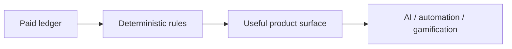

# Future Product Paths

These paths are intentionally **post-production**. They are useful directions for
Portfelik, but they should not block launch and should not be built before the
deterministic money model is trustworthy.

Launch readiness comes first:

- cashflow semantics are explicit (`paid` vs forecast vs all visible rows)
- shared-write UI matches RLS exactly
- plan settlement eligibility is deterministic by plan kind
- imports, transactions, plans, and exports pass the full gate suite

## Dependency Rule

Every future path must sit on top of deterministic state:

If the lower layer is ambiguous, the higher layer should not ship. AI,
gamification, and automation can only explain, prioritize, or draft around
financial truth that the app can already calculate and audit without them.

## 1. Full Offline Write Outbox

**User value:** edits made offline are not lost: transactions, plan links,
category changes, and import-review decisions can queue and replay when the user
comes back online.

**Why later:** the product is currently online-first. Reads use TanStack Query's
offline-first cache, but writes surface errors when offline. That is acceptable
for launch if the UI does not imply durable offline editing.

**Prerequisites:**

- all write mutations have idempotent retry semantics or conflict handling
- plan settlement links remain unique after replay
- import review decisions replay against a still-open preview session only
- user-facing conflict copy exists for stale rows

**Likely shape:**

- Dexie-backed outbox with mutation type, payload, dependency keys, and created
  timestamp
- replay worker on reconnect
- per-item failure state with retry/discard
- no queued write may bypass RLS or client-side permission gates

## 2. Split Allocations

**User value:** one transaction can contribute to multiple plans or categories:
one grocery receipt split across household/party, one salary split across
savings goals, one payment split between principal/interest.

**Why later:** the current model intentionally keeps one transaction linked to
at most one plan. Splitting changes core accounting semantics and should not be
bolted onto the existing `plan_transaction_links` behavior casually.

**Prerequisites:**

- paid-ledger and forecast semantics are stable
- settlement eligibility by plan kind is correct
- UX makes the unsplit transaction total reconcile exactly to split parts
- export includes split details in an understandable shape

**Likely shape:**

- allocation table with `transaction_id`, optional `plan_id`,
  optional `category_id`, `amount`, and `note`
- invariant: sum of allocations cannot exceed transaction amount unless an
  explicit partial-allocation state is supported
- transaction detail becomes the source of truth for allocation audit

## 3. Deeper Automation

**User value:** Portfelik reduces repeat work: better recurring detection,
automatic rule suggestions, import reminders with context, debt payment
detection, and settlement suggestions that learn from accepted/rejected matches.

**Why later:** automation is useful only when wrong automation is easy to spot,
undo, and explain. It should not create hidden financial truth.

**Prerequisites:**

- deterministic settlement scoring has score + reasons
- accepted/rejected suggestion memory exists
- rule creation remains visible and reversible
- every automated action has an audit trail or clear source label

**Likely shape:**

- "suggested, not applied" by default for new automation classes
- confidence thresholds produce either direct suggestion or pending review
- recurring and rule proposals live near the row/plan they explain

## 4. Gamification

**User value:** lightweight progress loops make healthy behavior visible:
import streaks, plan settlement completion, savings progress, debt payoff
milestones, and low-friction weekly/monthly check-ins.

**Why later:** gamification can distort behavior if it rewards the wrong
financial interpretation. It must measure confirmed product state, not noisy or
forecast-only state.

**Prerequisites:**

- import health uses committed sessions only
- plan progress uses paid linked transactions only
- savings/debt progress is transparent about manual snapshots vs imported rows
- users can dismiss or mute non-essential prompts

**Likely shape:**

- quiet badges and progress markers, not a generic task system
- "streaks" based on actions that strengthen the core loop:
  import, categorize exceptions, settle plans, update net-worth snapshot
- no shame copy, no pressure around spending

## 5. AI Explanations And Proposals

**User value:** AI helps explain the month, summarize unusual changes, propose
plan names/rules/keywords, and answer "why is this suggested?" in natural
language.

**Why later:** AI should be an assistive layer over deterministic engines. It
must not directly import, categorize, link, split, delete, or change financial
truth.

**Prerequisites:**

- deterministic facts are available as structured inputs
- no sensitive bank provenance leaks across group boundaries
- prompts and outputs are treated as untrusted suggestions
- user can see which exact transactions/plans support an explanation

**Allowed AI actions:**

- summarize a deterministic report
- draft a categorization rule name or keyword
- explain why a transaction matched a plan
- propose possible plans from historical patterns
- cluster unknown rows for review

**Disallowed AI actions:**

- commit an import
- create or edit a transaction without confirmation
- link/unlink a plan without confirmation
- change group scope or sharing
- override RLS, deterministic eligibility, or duplicate checks

## Sequencing

Recommended order after the production trust fixes:

1. Deterministic plan matching with accepted/rejected memory.
2. Deeper automation around recurring rows, category rules, and settlement.
3. Quiet gamification around committed imports and plan settlement.
4. Split allocations once settlement semantics are stable.
5. Full offline write outbox once mutation contracts are idempotent and tested.
6. AI explanations/proposals over the deterministic engines.

AI can appear earlier only as copy/explanation over already-computed facts. It
should not become an execution layer until every underlying action is safe,
auditable, and reversible without AI.
