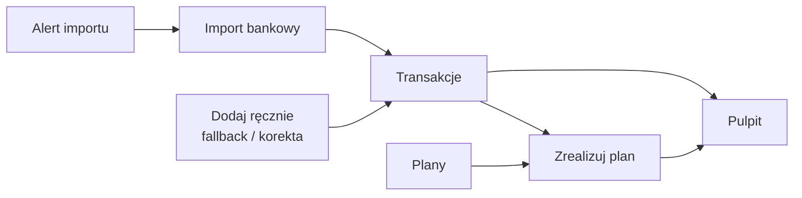
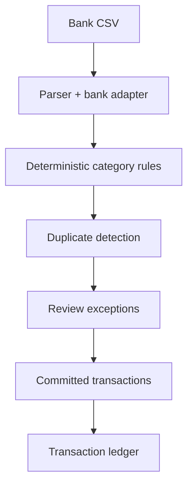
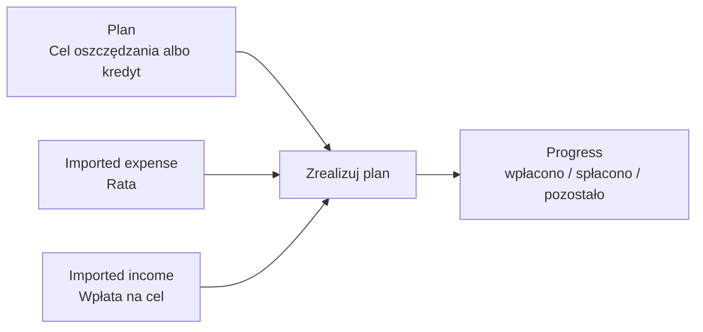
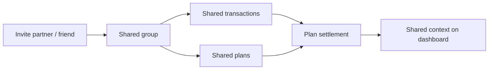

# Product Direction

Last updated: 2026-06-26

Portfelik is an import-first personal finance PWA. It is not trying to become a
manual bookkeeping spreadsheet with charts. The product should connect what
actually happened in the user's finances with what the user intended to do.

## Product Thesis

Portfelik helps users understand everyday finances by importing bank history,
organizing transactions, seeing the month clearly, and reconciling plans with
real spending.

The core loop:

## MVP Spine

The product has five first-class modules:

| Module         | Role                                                                                                         |
| -------------- | ------------------------------------------------------------------------------------------------------------ |
| **Pulpit**     | Shows the health of the current month: income, expenses, balance, largest categories, plan progress, and deterministic action prompts. |
| **Transakcje** | The confirmed ledger of financial history, upcoming obligations, recurring occurrences, and private cash-position context. |
| **Import**     | Structured intake from bank files: parse, preview, categorize, handle duplicates, confirm, and commit.       |
| **Plany**      | Future intent for `save` goals and `debt` loans; manual net-worth hero; settle by linking history transactions. |
| **Ustawienia** | Categories, categorization rules, profile, groups, invitations, personalization, and account controls.       |

This is the product contract:

> Import shows what happened. Transactions organize history. Plans express
> intent. Settlement connects reality to intent. Dashboard shows financial
> condition.

## Import Posture

Bank data is the preferred source of transaction truth. Import must be fast by
default and deliberate only where trust requires it.

The review screen is an exception-review surface, not a spreadsheet approval
screen:

Row-state taxonomy:

| Row state             | Meaning                                                     | User work                                                                                          |
| --------------------- | ----------------------------------------------------------- | -------------------------------------------------------------------------------------------------- |
| Clean categorized row | Parsed, categorized, not a duplicate.                       | Imports by default.                                                                                |
| Duplicate             | Probable duplicate of an existing transaction.              | Folded/skipped unless the user imports anyway.                                                     |
| Uncategorized         | Safe enough to import, but no category matched.             | Imports through the visible `Inne` fallback confirmation.                                          |
| Pending               | Real ambiguity or risk.                                     | Requires a user decision. Today this is not broadly auto-produced; future risk signals may add it. |
| User correction       | The user changes category, group, description, or decision. | Keep reversible and offer rule learning where useful.                                              |

Manual transactions remain supported, but their product role is fallback:
cash spend, missing bank rows, corrections, or exceptional records.

## Alerts

Alerts should reinforce the product loop instead of becoming a generic task
system. The first alert is an import reminder: the user can ask Portfelik to
remind them after 7, 14, or 30 days without a committed bank import.

This matches the import-first posture:

- The reminder points to **Import**, not manual entry.
- It is user-controlled in profile settings and can be disabled.
- It uses the existing notification inbox and push dispatcher; push permission
  remains a delivery choice, not the alert source of truth.
- The alert is based on confirmed import sessions, not parsed drafts.

Future alerts should follow the same rule: they must help the user keep
transactions, plans, groups, or settlement current, and they must be explainable
from deterministic product state.

Dashboard action cards follow the same rule. They are deterministic prompts over
already-computed product state: overdue or stale-import attention, off-track save
goals, spending anomalies, and settlement-ready plans. Dismissals are memory for
attention surfaces, not financial truth.

## Recurring Entries And Cash Position

Recurring entries are manageable future intent, not hidden committed history.
Near-term recurring occurrences can materialize as `upcoming` rows so users can
edit, skip, settle, or end the series. Farther future periods remain read-time
forecast. A skipped occurrence is remembered so sync does not recreate it.

Cash position is derived from a scoped opening balance plus transaction rows.
Private scope can show live paid balance and faint forecast balance; group/all
scope remains deliberately conservative until shared cash semantics are designed
end-to-end.

## Plans And Settlement

User-facing list workflows have been replaced by first-class **Plans**. A plan
describes future intent with a required period (`start_date` / `end_date`).
Current user-facing kinds are saving goals (`save`) and loans (`debt`); old
budget/outflow `spend` plans are retired. Plans should not create financial
truth by default. The primary settlement flow is:

Current settlement direction:

- Saving goals link income transactions; loans link expense transactions.
- A transaction belongs to at most one plan until split allocation is explicitly
  designed.
- Use the dedicated `plans` + `plan_transaction_links` model for settlement.
- Legacy shopping-list tables, checklist items, `transactions.shopping_list_id`,
  and list-completion RPCs are retired from the app surface.
- Manual transaction creation from a plan is allowed only as fallback; it should
  create a normal transaction and then link it to the plan.

## Groups And Invitations

Portfelik is personal finance, but not always single-player. Groups and
invitations are a first-class collaboration layer for couples, friends,
housemates, and other trusted small groups who share financial reality.

Groups should support the same product loop:

Direction:

- Invitations are the trust boundary. A user should not accidentally share
  private financial data.
- Group membership should become role-based, not flat. Owners manage lifecycle
  and invitations; nominated co-owners can manage group-scoped transactions and
  plans; regular members participate without getting broad administrative
  control.
- Shared transactions and shared plans should make couple/friend workflows
  natural: trips, groceries, home projects, recurring household costs, and
  expenses to settle together.
- Import provenance remains owner-only even when a resulting transaction is
  shared. Bank metadata should not leak to group members or co-owners.
- Plan settlement must respect private/group scope. A private plan should not
  link to a group transaction unless the user deliberately changes scope.
- Future matching and AI explanations must account for group context, but RLS
  and deterministic eligibility remain the hard guard.

## Deterministic First, AI Later

Financial state changes need deterministic, auditable engines:

- parsers and bank adapters
- category rules
- duplicate detection
- plan eligibility and link checks
- future plan matching scores and reasons

AI may help later by explaining, summarizing, drafting names, proposing
keywords, or clustering unknown rows. AI must not directly mutate financial
truth. The deterministic engine decides what is allowed; the user confirms
exceptions.

The broader post-production paths - AI, gamification, deeper automation, split
allocations, and a durable offline write outbox - are tracked in
[future product paths](./future-paths.md). They are useful only after the
deterministic money model is trustworthy: paid-vs-forecast semantics are clear,
shared-write permissions match RLS, and plan settlement eligibility is correct
by plan kind.

## Roadmap

| Stage     | Product scope                                                                                                                                                                              |
| --------- | ------------------------------------------------------------------------------------------------------------------------------------------------------------------------------------------ |
| **MVP**   | Pulpit, Transakcje, Import CSV, first-class Plany, Ustawienia, groups/invites, categories, rules, privacy/regulatory basics.                                                               |
| **MVP+**  | Manual plan-to-transaction linking, plan progress, import as first-class module, manual transactions clearly secondary, shared plan settlement scope rules, group co-owner role direction, save/debt plan kinds, derived cash position, and actionable recurring occurrences. |
| **V1**    | Deterministic plan matching and attention surfaces: suggestions, score, reasons, accepted/rejected/dismissed memory.                                                                       |
| **Later** | Future product paths after the deterministic trust fixes: deeper automation, quiet gamification, split allocations, durable offline write outbox, AI explanations/proposals, net-worth snapshot hub, Belka in invest compare, deeper observability. |

## Design Bar

Every workflow should answer:

- What outcome is the user trying to reach?
- Which decisions can deterministic rules handle safely?
- Which exceptions need user attention?
- What can be undone or corrected?
- What explanation builds trust at the moment of decision?
- If AI is involved, which deterministic guard validates it?
