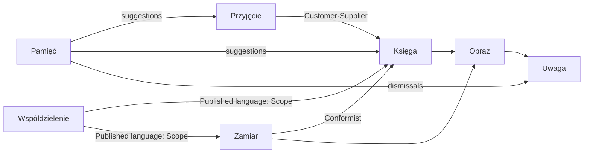

# Thin surface

Date: 2026-09-28

Baseline: `origin/dev` at `93eac12` (category limits and the import story are
already on dev). This design does not bring net worth back.

JakStoimy keeps its thesis and its engine. The default screen of each place
shows the outcome, one action, and exceptions. A sentence appears only on an
exception or an error. Everything else stays one gesture away, on the record
or behind an explicit more.

This document is the published language for the default screen. It does not
authorize a schema change, a new product thesis, or a split of the current
service folder into packages.

## Method

The shape comes from the Domain Drivers canvas (Sławomir Sobótka, Jakub
Pilimon) and from the SmartSchedule reference model:

- Strategic design first. A context owns one language. Neighbors talk through
  a facade, a published language, and a named relationship.
- Tactical design stays inside the context. The aggregate is the consistency
  boundary.
- A downstream reader conforms to the published language. It does not grow its
  own money model.
- Attention works like the Risk saga: it speaks only when a resolution path
  exists. It does not own financial truth.
- The anchor is not a shared kernel. Same name, local types.

The screen is not a bounded context. It is a conformist of the published
language defined below.

## Decision

Information stays in the product. The first screen stops teaching the engine.

Out of scope:

- No new tables, columns, or RLS policies.
- No return of net worth, surplus, or shopping lists.
- No package-per-context move.
- No second settlement language. Save and debt both settle with a paid expense.
- No split of a transaction across plans.
- No new debt attention card.

## Deep model

Money is a ledger fact, an intent, or a projection. The screen may show them
side by side. It must not fold them into one number.

The repeating value is the **anchor**: an amount accepted as truth at the end
of calendar day D in Europe/Warsaw. Movements on D are already inside it.
Only later movements add.

| Where it lives | Fields | What it protects |
| --- | --- | --- |
| Cash | `cash_positions.opening_amount` + `as_of_date` | Live position and forecast |
| Save correction | latest `plan_progress_snapshots` balance on day D | Saved amount |
| Debt | `plan_debt_terms.anchor_balance` + `balance_anchor_date` | Balance replay |

## Context map

Przyjęcie hands Księga a committed movement. Bank provenance stays owner-only.
Zamiar stores links to fact ids and does not rewrite the fact. Eligibility
stays `plan-settlement-policy.ts`: active plan, paid expense, day inside the
period, not already linked, scope matches.

Scope is `own` or one group id. When the user has a group, it is a visible
stamp. It is never a silent mode.

Obraz writes nothing. The ledger number is always shown. The forecast number
is shown only when income, expenses, or net differ. `projected` is not a
transaction status.

## Closed Kokpit exception catalog

Nothing else may appear as an exception on the default Kokpit.

| Exception | Rule | Opens |
| --- | --- | --- |
| Overdue facts | existing `buildDashboardActions` kind `overdue` | Filtered transaction list |
| Save plan off the current-month pace | existing kind `save_shortfall` | That plan |
| Import is stale | reminder is enabled, a commit exists, and days since that commit are at least the cadence | Import |
| Category cap exceeded | `spentInPile` is greater than `cap_amount` for that category, window, and scope | That category's facts |

An empty ledger does not also raise the import exception. The empty line and
the import button are that prompt.

A fresh import card, a pile under its cap, spending-insight prose, chart
hints, the upcoming list, plan-match suggestions, and plan-progress cards are
not exceptions. They leave the default screen. Their behavior stays one
gesture away. Plan-match suggestions stay on the plan, where settlement
already lives.

Each exception is one line. The current title stays, because it already
carries the count and the amount, or the plan name and the shortfall. The
detail sentence is not rendered.

## Published language

1. **Fakt.** Day, who, amount, category, scope. No sentence.
2. **Zamiar.** Name, one number, on track or not.
3. **Wyjątek.** One line and one verb.
4. **Pamięć.** The verb is the copy, after a correction or on the exception.
5. **Zakres.** A stamp, visible when more than one scope exists.
6. **Obraz.** Nouns and numbers. The word "prognoza" only beside a different second number.

Commands: Przyjmij, Popraw, Zapamiętaj, Powiąż, Skoryguj, Ustal. Dodaj ręcznie
stays secondary to import.

Empty copy:

- Kokpit and Transakcje with no facts: "Brak transakcji." Primary button: "Importuj wyciąg". The example month stays as the quieter second action where it exists today.
- Plany: "Brak planów."
- A filtered empty state is one line that names the filter. The hint sentence under it goes away.

Errors stay two short sentences. One sentence of explanation is allowed only
on a field the engine filled: duplicate, suggested category, forecast beside
the result.

## Screens

Navigation stays Kokpit, Transakcje, Plany, plus settings. Import stays a flow.

Kokpit default: ledger result, forecast only when it differs, the closed
exception list, scope stamp when a group exists, no text under the result
when the list is empty. Period, piles, spending comparison, history, plan
progress, and upcoming open from the result or from "Więcej". Glossary leaves
the daily path.

Transakcje default: current-month facts, import as the primary button, manual
add secondary, header numbers instead of a summary essay, filters visible
when one is active.

Plany default: one row per plan. Settlement, schedule, and anchor correction
stay inside the plan.

Import review stays an exception surface. Settings keeps categories, rules,
groups, profile, and at most one short line per word that still appears on
screen.

## Delivery

UI and copy only. Recompile Paraglide after `messages/pl.json`. No migration.
